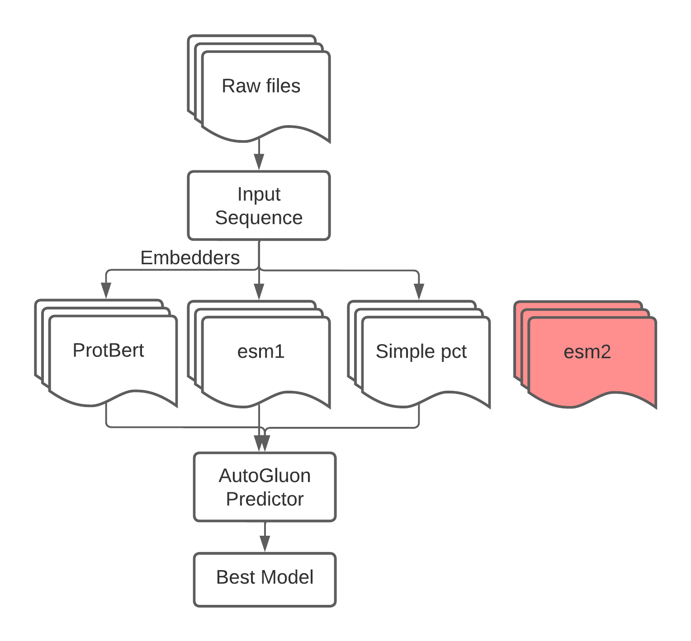

# Pfam Seed Random Split

# !! please read and focus on the notebook in the home directory !!

Dataset url: https://www.kaggle.com/datasets/googleai/pfam-seed-random-split

I have locally saved the raw data in the random_split/ it is partitioned into the three folds as per the initial dataset.

Definitions:
* Sequence: These are the Amino Acid sequences for each domain, which is a sub part of a protein. There are around 20 common amino acids and 4 uncommon ones.
* family_id/ family_accession: Labels for the model, containing the english words for the family and the Pfam ID.
* aligned_sequence: It's a sequence from the multiple sequence alignment - with gaps retained. 
* Sequence name: This is the name given to the sequence, form: "$uniprotaccessionid/$startindex-$end_index"

Steps:
* Setup conda environment using environment.yml and select in notebook pfam_model.ipynb
* This can be done by going to the directory with the environent.yml and running:
```
conda env create -f environment.yml -n pfam_env
```

## Here is an overview of my approach

* I have opted for embedders to a classifier, with the available embedders in the boxes and esm-2 the next to add to the list.
* More details in pfam_model.ipynb




